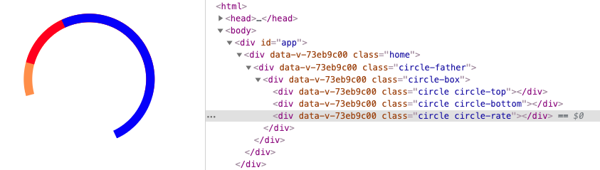
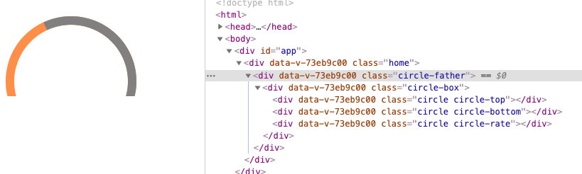

### 功能点拆分
* 需要实现效果图


* 功能点
* 总共角度为210度，当然其他角度的可以模仿实现，同样的思路
* 进度条是环形，不是扇形
* 进度条角度可以任意变换表示比例，按照比例划分
#### 功能点分析
##### 实现一个环形，即中央为空心
实现的方式有很多种，我们可以借鉴网上的底部画一个有颜色的大圆，上面盖一个白色的小圆。
这里使用的是另一种方式，我们可以看做有颜色的部分就是圆的边框
首先实现一个圆，接着设置圆的边框颜色就可
```javascript
<div class="circle-box">
    <div class="circle"></div>
</div>
.circle-box {
  position: relative;
  width: 160px;
  height: 160px;
}
.circle {
  position: absolute;
  width: 160px;
  height: 160px;
  border-radius: 50%;
  border: 12px solid blue;
}
```

至此算是完成了一个环形
##### 实现只有一种颜色的任意角度的环形
这里就需要使用上旋转叠加显示了
首先我们需要两个半圆，一个上面的半圆，一个下面的半圆，正好可以拼成一个整圆。
然后让其中一个半圆以圆心进行旋转，就会和另一个半圆有角度重叠，也会让整个圆缺失一部分（缺失的角度最大是180度，此时两个半圆完全重叠），这时如果让缺失部分显示我们想要的颜色即可。如果想要显示超过180的环，那么我们可以把缺失部分置成背景色，两个半圆都设置成想要的颜色，就可以得到180-360任意角度。所以0-360度任意角度都可以通过两半圆旋转得到
###### 实现一个半圆
根据上面的环形圆，进行裁剪，可以得到半圆(clip用法大家可以自行百度)
```javascript
<div class="circle-box">
  <div class="circle circle-top"></div>
  <div class="circle circle-bottom"></div>
</div>
.circle-box {
  position: relative;
  width: 160px;
  height: 160px;
}
.circle {
  position: absolute;
  width: 160px;
  height: 160px;
  border-radius: 50%;
  border: 12px solid blue;
}
.circle-top {
  clip: rect(0px 184px 92px 0px); // 上半圆
}
.cirlce-bottom {
  clip: rect(92px 184px 184px 0px); // 下半圆
}
```

两个圆没有进行旋转得情况

###### 实现任意角度圆环
接下来让上半圆进行旋转
```javascript
.circle-top {
  clip: rect(0px 184px 92px 0px);
  transform: rotate(15deg);
}
```

然后和下半圆进行组合，可以得到刚刚旋转出的一个角度

当然可以让下半圆进行旋转
```javascript
.circle-top {
  clip: rect(0px 184px 92px 0px); // 上半圆
}
.cirlce-bottom {
  clip: rect(92px 184px 184px 0px); // 下半圆
  transform: rotate(-150deg);
}
```

这样就得到了210度的圆环，我们让整体旋转视觉上变正即可

至此，我们知道了如何实现任意角度的圆环。保存这个组件。我们把这个圆环做成可以根据传入的角度来操作dom来动态实现任意角度的环
##### 实现环形进度条
* 原思路：调用这个组件两次，一次写死角度210度，显示底色，一次是0-210度之间显示进度条颜色，这样叠加可以显示任意角度的进度条，但是实现发现显示进度条颜色的圆环会把显示底色的圆环完全遮挡，显示不出来底色，所以我们来换种思路，也是本篇文章想重点介绍的。因为上面的大家都可以百度到
* 我们借鉴两个半圆旋转可以得到0-360度圆环的思路（只有，两种颜色：圆环的边框色，和缺失的背景色即上面的白色），现在来使用三个半圆旋转得到同时有三个颜色的圆环即是实现了我们的需求（进度条色，圆环底色，缺失部分颜色即白色）

首先设置三个半圆，分别是top半圆，bottom半圆，rate半圆,三个半圆的顺序即top < bottom < rate
```javascript
// 设置不同颜色便于区分，此时top和rate重叠，rate遮盖top
.circle-top {
  clip: rect(0px 184px 92px 0px);
  border-color: gray;
}
.circle-bottom {
  clip: rect(92px 184px 184px 0px);
  border-color: red;
}
.circle-rate {
  clip: rect(0px 184px 92px 0px);
  border-color: blue;
}
```

目前top和rate重合
首先我们使用top和bottom旋转出底盘的210度，根据上一步的讲解，我们直接让bottom半圆进行旋转即可
接下来讲解的所有地方top和bottom的旋转角度都会保持这个不会变化以组成210度的环
```javascript
.circle-bottom {
  clip: rect(92px 184px 184px 0px);
  border-color: red;
  transform: rotate(-150deg);
}
```

然后我们让rate半圆进行旋转，可以看看会出现什么

我们知道gray是top半圆颜色，因为rate半圆的旋转，所以top半圆得以露出一定角度（rate旋转的角度）的环；

blue是rate半圆的颜色，因为层级最高，所以rate的颜色始终显示

red是bottom半圆的颜色，被rate半圆遮挡了大部分，只有一部分露出

三部分半圆的关系我们已经清楚了，接下来可以进行三个半圆的旋转来得出我们想要的角度

我们知道总共的角度是210度，而rate半圆的180度会始终显示，只有30度可分配在top半圆和bottom半圆上，所以针对任意角度的进度条颜色我们要分情况讨论
* 进度条要显示的颜色在0-30度
* 进度条颜色在30-180度
* 进度条颜色在180-210度；

0-30度时，我们可以把需要显示的颜色分配给top半圆，rate半圆显示想要的角度即可，rate半圆旋转0-30度，rate半圆和bottom半圆显示同一种颜色即进度条底色

可以只显示top，使用rate把bottom遮挡，top显示进度条颜色，bottom、rate显示底环色
```javascript
.circle-top {
  clip: rect(0px 184px 92px 0px);
  border-color: #FF8E3D;
}
.circle-bottom {
  clip: rect(92px 184px 184px 0px);
  border-color: gray;
  transform: rotate(-150deg);
}
.circle-rate {
  clip: rect(0px 184px 92px 0px);
  border-color: gray;
  transform: rotate(15deg);
}
```

180-210度时，rate始终显示，让rate旋转想要的角度减去180度

显示top、rate，rate遮挡bottom的部分，top、rate显示进度条色，bottom显示底环色
```javascript
.circle-top {
  clip: rect(0px 184px 92px 0px);
  border-color: #FF8E3D;
}
.circle-bottom {
  clip: rect(92px 184px 184px 0px);
  border-color: gray;
  transform: rotate(-150deg);
}
.circle-rate {
  clip: rect(0px 184px 92px 0px);
  border-color: #FF8E3D;
  transform: rotate(15deg);
}
```

30-180度时，rate半圆旋转想得到的角度即可,让rate半圆旋转超过bottom半圆，多出的部分呢使用clip截取
我们可以先看下三部分圆的情况

// rate半圆先不显示，我们会发现top半圆最多也只会显示30度，因为被bottom半圆遮挡了
```javascript
.circle-top {
  clip: rect(0px 184px 92px 0px);
  border-color: #FF8E3D;
}
.circle-bottom {
  clip: rect(92px 184px 184px 0px);
  border-color: red;
  transform: rotate(-150deg);
}
.circle-rate {
  display: none;
  clip: rect(0px 184px 92px 0px);
  border-color: #FF8E3D;
  transform: rotate(15deg);
}
```

然后让rate半圆显示，看出三个半圆区别

然后让整体旋转正(即最开始的点按照210度展示旋转正，参照上方)，方便外部截取（rate多出的部分进行截取掉）

显示top、bottom，rate遮挡bottom的部分，top、bottom显示进度条色，rate显示底环色
```javascript
.circle-box {
  position: relative;
  width: 100%;
  height: 100%;
  transform: rotate(-15deg);
}
.circle-top {
  clip: rect(0px 184px 92px 0px);
  border-color: #FF8E3D;
}
.circle-bottom {
  clip: rect(92px 184px 184px 0px);
  border-color: #FF8E3D;
  transform: rotate(-150deg);
}
.circle-rate {
  clip: rect(0px 184px 92px 0px);
  border-color: gray;
  transform: rotate(80deg);
}
```

然后我们在外层div进行裁剪
```javascript
<div class="circle-father">
    <div class="circle-box">
        <div class="circle circle-top"></div>
        <div class="circle circle-bottom"></div>
        <div class="circle circle-rate"></div>
    </div>
</div>
.circle-father {
  position: absolute;
  height: 184px;
  width: 184px;
  clip: rect(0px 184px 113px 0px);
}
.circle-box {
  position: relative;
  width: 100%;
  height: 100%;
  transform: rotate(-15deg);
}
.circle {
  position: absolute;
  width: 160px;
  height: 160px;
  border-radius: 50%;
  border: 12px solid blue;
}
.circle-top {
  clip: rect(0px 184px 92px 0px);
  border-color: gray;
}
.circle-bottom {
  clip: rect(92px 184px 184px 0px);
  border-color: red;
  transform: rotate(-150deg);
}
.circle-rate {
  clip: rect(0px 184px 92px 0px);
  border-color: blue;
  transform: rotate(180deg);
}
```


裁剪时高度应该如何计算，大家根据自己的角度自己计算出来